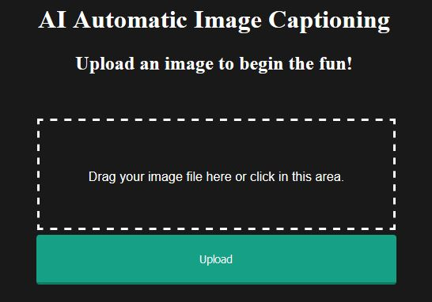
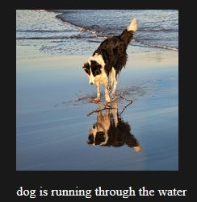

# Automatic Photograph Captioning

This project uses Flask to deploy a deep learning model for automatic captioning of uploaded images. Don't know how to caption your photo? The application will give suggestions based on its past experience.

Deployed Web Application - [CLICK HERE](http://auto-caption.herokuapp.com/)

### Screenshots

### How does this model work?
The last layer of a deep Convolutional Neural Network (CNN) trained to classify objects is used in a final Softmax among known classes of objects, assigning a probability that each object might be in the image. For this project, by removing that final layer, we can instead feed the CNN’s rich encoding of the image into a RNN designed to produce phrases. We can then train the whole system directly on images and their captions, so it maximizes the likelihood that descriptions it produces best match the training descriptions for each image.

   <h3 class="tab"> What is an automatic image captioning model? </h3>
   <ul style="list-style-type:circle">
      <li> An automatic image captioning model takes a photograph as input and uses an analytical model to determine what is in the photograph (image recognition) based on historical data to then automatically generate a caption for the photograph.
      </li>
   </ul>
   <h3 class="tab"> Importance of automatic image captioning?</h3>
      <ul style="list-style-type:circle"> 
         <li>Help visually impaired people understand pictures</li>
         <li>Provide alternate text for images in parts of the world where mobile connections are slow</li>
         <li>Make it easier for everyone to search on Google for images</li>
         <li>Can extend this to describe what is happening in videos - can be used for security and/or logging</li>
      </ul>
   

### What is the importance of deploying this project end-to-end?
  - Deployment is often an overlooked phase from many theoretical data scientists.
  - In order to start using a model for practical decision-making, it needs to be effectively deployed into production. If you cannot reliably get practical insights from your model, then the impact of the model is severely limited.
  - In order to get the most value out of machine learning models, it is important to seamlessly deploy them into production so a business can start using them to make practical decisions.
  
  
### Ideas to explore to improve model:
 - <b>Alternate Pre-Trained Image Models.</b> A small 16-layer VGG model was used for
    feature extraction. Consider exploring larger models that offer better performance on the
    ImageNet dataset, such as Inception.
 - <b>Smaller Vocabulary.</b> A larger vocabulary of nearly eight thousand words was used in
    the development of the model. Many of the words supported may be misspellings or only
    used once in the entire dataset. Refine the vocabulary and reduce the size, perhaps by
    half.
 - <b>Pre-trained Word Vectors.</b> The model learned the word vectors as part of fitting the
    model. Better performance may be achieved by using word vectors either pre-trained on
    the training dataset or trained on a much larger corpus of text, such as news articles or
    Wikipedia.
 - <b>Train Word2Vec Vectors.</b> Pre-train word vectors using Word2Vec on the description
    data and explore models that allow and don’t allow fine tuning of the vectors during
    training, then compare skill.
 - <b>Tune Model.</b> The configuration of the model was not tuned on the problem. Explore
    alternate configurations and see if better performance can be achieved.
 - <b>Inject Architecture.</b> Explore the inject architecture for caption generation and compare
    performance to the merge architecture used in this tutorial.
 - <b>Alternate Framings.</b> Explore alternate framings of the problems such as generating the
    entire sequence from the photo alone.
 - <b>Pre-Train Language Model.</b> Pre-train a language model for generating description
    text, then use it in the caption generation model and evaluate the impact on model
    training time and skill.</b>
 - <b>Truncate Descriptions.</b> Only train the model on description at or below a specific
    number of words and explore truncating long descriptions to a preferred length. Evaluate
    the impact on training time and model skill.
 - <b>Alternate Measure.</b> Explore alternate performance measures beside BLEU such as
    ROGUE. Compare scores for the same descriptions to develop an intuition for how the
    measures differ in practice.
 - <b>More training data.</b> This experiment uses only Flickr8k; try experiments with this system on several openly published datasets, including Pascal, Flickr8k, Flickr30k and SBU [and [MS COCO](https://github.com/ntrang086/image_captioning)], show how robust the qualitative results are. (see [this](https://arxiv.org/abs/1411.4555) paper) [see [exploring image captioning data sets](http://sidgan.me/technical/2016/01/09/Exploring-Datasets)]
    
    

  Project based on <a href="https://machinelearningmastery.com/develop-a-deep-learning-caption-generation-model-in-python/">this</a> article.

